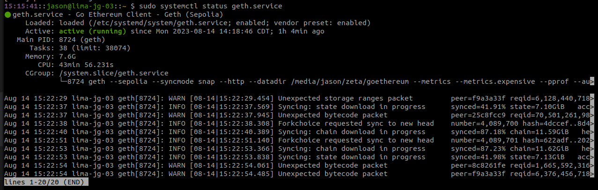
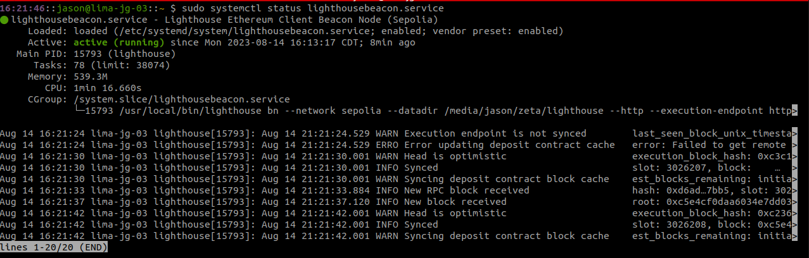

# Ethereum Node Setup

<i>Last editted 14-Aug-2023</i><br>

A guide for installing an Ethereum Sepolia node.<br>

This guide will cover the installation of the Lighthouse client. This is a requirement for node operation following the Ethereum 2.0 merge.

Additionally, we will cover the installation of Geth and storage of the blockchain data on an external drive. The blockchain database mode use will be `snapshot` mode. This mode is the most efficient for syncing the blockchain and is the recommended mode for nodes with limited resources. To read more on the different database sync-modes, see the <a href="https://geth.ethereum.org/docs/fundamentals/sync-modes">Geth documentation</a>.

## Working Environment

-   <b>Machine</b>: Ubuntu 22.04.3 LTS
-   <b>Golang version</b>: go1.18.1 linux/amd64
-   <b>Geth version</b>: 1.12.2-stable-bed84606

## Install Prerequisites

-   Fully update packages.
    ```bash
    $ sudo apt update && sudo apt upgrade -y
    ```
    <br>
-   Install useful scripts.

    ```bash
    $ sudo apt -y install software-properties-common wget curl ccze
    ```

    -   `software-properties-common`: Package with useful scripts for adding and managing Personal Package Archives (PPAs), among other software properties tasks.
    -   `wget`: Command-line utility for downloading files from the internet.
    -   `curl`: Command-line utility for transferring data from or to a server.
    -   `ccze`: A robust log colorizer.<br><br>

-   Install Geth with the installation instructions at <a href="https://go.dev/doc/install">https://go.dev/doc/install</a>.

## Install Geth

Add the Ethereum PPA and install the Geth package.

```bash
$ sudo add-apt-repository -y ppa:ethereum/ethereum
$ sudo apt -y install geth
```

## Install Lighthouse

Lighthouse is a required Ethereum consensus client for this installation. This is a requirement for node operation following the Ethereum 2.0 merge. If the lighthouse client is not installed, the node will not be able to sync with the Ethereum network.

```bash
$ cd ~
$ wget https://github.com/sigp/lighthouse/releases/download/v4.2.0/lighthouse-v4.2.0-x86_64-unknown-linux-gnu.tar.gz
$ tar xvf lighthouse-v4.2.0-x86_64-unknown-linux-gnu.tar.gz
$ rm lighthouse-v4.2.0-x86_64-unknown-linux-gnu.tar.gz
```

Install `lighthouse` globally.

```bash
$ sudo cp ~/lighthouse /usr/local/bin
$ rm ~/lighthouse
```

## Create JWT Token

The JWT token will be used for RPC authentication. We will create the token and make it publicly readable.

```bash
$ sudo mkdir -p /var/lib/ethereum
$ openssl rand -hex 32 | tr -d "\n" | sudo tee /var/lib/ethereum/jwttoken
$ sudo chmod +r /var/lib/ethereum/jwttoken
```

## Configure Geth Node

Create a new user for the Geth node, create the data directory on an external drive, and set the permissions for the new user.

<b>Note</b>: For this guide, we will use the user `goeth` and the external drive mounted to `/media/jason/zeta`. Replace these values with your own.

```bash
$ sudo useradd --no-create-home --shell /bin/false goeth
$ sudo mkdir /media/jason/zeta/goethereum
$ sudo chown -R goeth:goeth /media/jason/zeta/goethereum
```

Create a systemd service config file to configure the Geth node.

```bash
$ sudo nano /etc/systemd/system/geth.service
```

Paste the following configuration into the file, exit, and save.

```text
[Unit]
Description=Go Ethereum Client - Geth (Sepolia)
After=network.target
Wants=network.target

[Service]
User=goeth
Group=goeth
Type=simple
Restart=always
RestartSec=5
TimeoutStopSec=180
ExecStart=geth \
    --sepolia \
    --syncmode snap \
    --http \
    --datadir /media/jason/zeta/goethereum \
    --metrics \
    --metrics.expensive \
    --pprof \
    --authrpc.jwtsecret=/var/lib/ethereum/jwttoken

[Install]
WantedBy=default.target
```

Breakdown of the configuration:

-   <strong>`--sepolia`</strong>: Enables the Sepolia testnet network.
-   <strong>`--syncmode snap`</strong>: Enables snapshot mode for the database.
-   `--http`: Enables the HTTP-RPC server.
-   <strong>`--datadir`</strong>: Specifies the data directory for the blockchain data. This is the directory we created earlier.
-   `--metrics`: Enables metrics collection and reporting (optional).
-   `--metrics.expensive`: Enables expensive metrics collection and reporting (optional).
-   `--pprof`: Enables pprof HTTP server (optional).
-   `--authrpc.jwtsecret`: Specifies the path to the JWT token we created earlier.

Reload systemd to reflect the changes and start the service.

```bash
$ sudo systemctl daemon-reload
$ sudo systemctl start geth.service
```

Check the status of the service (using `q` to exit).

```bash
$ sudo systemctl status geth.service
```

The output should show `active (running)` in green like the example below:


If the service encounters permissions errors, proceed to the next section. Otherwise, skip to the <a href="#configure-lighthouse-beacon-node">Configure Lighthouse Beacon Node</a> section.

## Data Directory Auditing

If the external drive is formatted with NFTS, the `ntfs-3g` driver will be required to correctly mount and manage permissions for the drive. Install the `ntfs-3g` driver.

```bash
$ sudo apt update
$ sudo apt install ntfs-3g
```

Record the identifier of the external drive (e.g. `/dev/sda4`).

```bash
$ lsblk
```

Mount the external drive with the appropriate permissions. For this guide, we will use the drive identifier `/dev/sda4`. Replace this value with your own.

```bash
$ sudo umount /media/jason/zeta
$ sudo mount -t ntfs-3g -o uid=goeth,gid=goeth,permissions /dev/sda4 /media/jason/zeta
```

Make the mount permanent by adding the following line to `/etc/fstab`.

```bash
$ sudo nano /etc/fstab
```

```text
/dev/sda4 /media/jason/zeta ntfs-3g uid=goeth,gid=goeth,permissions 0 0
```

Ensure the entire path to the data directory allows for execute ('<b>x</b>') permissions for the `goeth` user. If the path does not allow for execute permissions, the Geth node will not be able to write to the directory and you will receive an error similar to the following:

```bash
INFO [08-14|14:08:14.945] Smartcard socket not found, disabling    err="stat /run/pcscd/pcscd.comm: no such file or directory"
Fatal: Failed to create the protocol stack: mkdir /media/jason/zeta: permission denied
geth.service: Main process exited, code=exited, status=1/FAILURE
geth.service: Failed with result 'exit-code'.
```

Audit path.

```bash
ls -ld /media/
ls -ld /media/jason/
ls -ld /media/jason/zeta/
```

Should a path not allow for execute permissions (e.g. `drwxr-x---`), add the execute permission to the path for the `goeth` user without changing the permissions for the other users.

```bash
$ sudo apt-get install acl
$ sudo setfacl -m u:goeth:x /media/jason/
$ sudo setfacl -m u:lighthousebeacon:x /media/jason/
```

Verify the path now allows for execute permissions for the `goeth` user.

```bash
$ getfacl /media/jason/
```

Restart and verify the status of the Geth service.

```bash
$ sudo systemctl daemon-reload
$ sudo systemctl restart geth.service
```

## Configure Lighthouse Beacon Node

Create a dedicated user for running the Lighthouse beacon node.

```bash
$ sudo useradd --no-create-home --shell /bin/false lighthousebeacon
$ sudo mkdir -p /var/lib/lighthouse
$ sudo chown -R lighthousebeacon:lighthousebeacon /var/lib/lighthouse
```

Create a systemd service config file to configure the Lighthouse beacon node.

```bash
$ sudo nano /etc/systemd/system/lighthousebeacon.service
```

Paste the following configuration into the file, exit, and save.

```text
[Unit]
Description=Lighthouse Ethereum Client Beacon Node (Sepolia)
Wants=network-online.target
After=network-online.target

[Service]
Type=simple
User=lighthousebeacon
Group=lighthousebeacon
Restart=always
RestartSec=5
ExecStart=/usr/local/bin/lighthouse bn \
    --network sepolia \
    --datadir /media/jason/zeta/lighthouse \
    --http \
    --execution-endpoint http://127.0.0.1:8551 \
    --validator-monitor-auto \
    --checkpoint-sync-url https://beaconstate-sepolia.chainsafe.io \
    --execution-jwt /var/lib/ethereum/jwttoken

[Install]
WantedBy=multi-user.target
```

Breakdown of the configuration:

-   <strong>`--network sepolia`</strong>: Enables the Sepolia testnet network.
-   <strong>`--datadir`</strong>: Specifies the data directory for the beacon chain data.
-   `--http`: Enables the HTTP-RPC server.
-   <strong>`--execution-endpoint`</strong>: Specifies the endpoint for the execution client. This is the Geth node we configured earlier.
-   `--validator-monitor-auto`: Enables the validator monitor.
-   <strong>`--checkpoint-sync-url`</strong>: Specifies the URL for the checkpoint sync service. A list of the available services can be found <a href="https://eth-clients.github.io/checkpoint-sync-endpoints/">here</a>.
-   `--execution-jwt`: Specifies the path to the JWT token we created earlier.

Reload systemd to reflect the changes and start the service.

```bash
$ sudo systemctl daemon-reload
$ sudo systemctl start lighthousebeacon.service
```

Check the status of the service (using `q` to exit).

```bash
$ sudo systemctl status lighthousebeacon.service
```

The output should show `active (running)` in green like the example below:


## Enable Services on Boot

Enable the Geth and Lighthouse beacon node services on boot.

```bash
$ sudo systemctl enable geth.service
$ sudo systemctl enable lighthousebeacon.service
```

To watch the logs for the Geth and Lighthouse node services, run the following commands in separate terminals:

```bash
$ sudo journalctl -f -u geth.service -o cat | ccze -A
```

```bash
$ sudo journalctl -f -u lighthousebeacon.service -o cat | ccze -A
```

## Test Network

## Sources

-   <a href="https://calyptus.co/">calyptus.co</a>
-   <a href="https://github.com/eth-educators/ethstaker-guides/blob/main/merge-goerli-prater.md">eth-educators on Github</a>
-   <a href="https://geth.ethereum.org/">geth.ethereum.org</a>
-   <a href="https://lighthouse-book.sigmaprime.io/validator-monitoring.html?highlight=validator-monitor-auto#automatic">lighthouse-book.sigmaprime.io</a>
-   <a href="https://ethereum.stackexchange.com/questions/28703/full-list-of-geth-terminal-commands">Ethereum StackExchange</a> post by <a href="https://ethereum.stackexchange.com/users/19779/kris-randall">Kris Randall</a>
